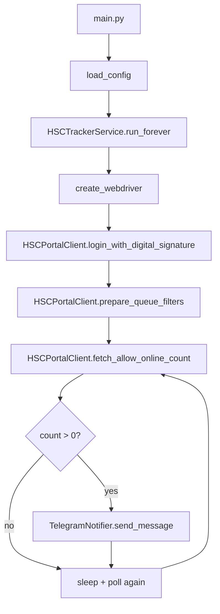

# HSC Tracker

Automated tracker for HSC appointment slot availability with Telegram notifications.

## What This Project Does

This service logs into the HSC portal with a digital signature, polls queue availability for a target department, and sends Telegram alerts when new slots appear.

## Architecture Overview

### High-level Flow



### Runtime Layers

1. Entry point layer
- `main.py` initializes logging, loads config, and starts the monitoring service.

2. Configuration layer
- `hsc_tracker/config.py` reads environment variables and validates required settings.
- Produces immutable `AppConfig` used across the app.

3. Orchestration layer
- `hsc_tracker/monitor.py` owns the long-running loop and session lifecycle.
- Handles retries, cooldowns, and browser session rotation.

4. Browser/API client layer
- `hsc_tracker/browser.py` contains Selenium logic for authentication and API polling.
- Raises domain exceptions (`SessionExpiredError`, `RateLimitedError`) for clean control flow.

5. Notification layer
- `hsc_tracker/notifier.py` sends Telegram notifications and logs API failures.

6. Shared concerns
- `hsc_tracker/logging_setup.py` central logging config.
- `hsc_tracker/exceptions.py` domain-specific exceptions.

## Project Structure

```text
0_HSC_TRACKER/
├── main.py
├── requirements.txt
└── hsc_tracker/
    ├── __init__.py
    ├── browser.py
    ├── config.py
    ├── exceptions.py
    ├── logging_setup.py
    ├── monitor.py
    └── notifier.py
```

## Control Loop Behavior

- Sends one startup Telegram health-check.
- Starts authenticated browser session.
- Polls API every `POLL_INTERVAL_SECONDS` with jitter.
- Notifies only when slot count changes from previous positive value.
- Rotates browser session after `SESSION_RESTART_SECONDS`.
- On rate-limit response: sleeps for `RATE_LIMIT_COOLDOWN_SECONDS`.
- On session expiry: re-authenticates.

## Environment Variables

Required:
- `TELEGRAM_TOKEN`
- `CHAT_ID`
- `KEY_PASSWORD`
- `KEY_PATH`

Important optional values:
- `KEY_PROVIDER`
- `POLL_INTERVAL_SECONDS`
- `POLL_JITTER_SECONDS`
- `RATE_LIMIT_COOLDOWN_SECONDS`
- `SESSION_RESTART_SECONDS`
- `SERVICE_ID`
- `TARGET_DEPARTMENT_ID`
- `HEADLESS`

## Quick Start

1. Create and activate virtual environment
```bash
python3 -m venv .venv
source .venv/bin/activate
```

2. Install dependencies
```bash
pip install -r requirements.txt
```

3. Create `.env` with required values and run
```bash
python main.py
```

## Notes for GitHub Publication

- Never commit real secrets in `.env`.
- Keep digital signature key files outside the repository.
- Document your target environment (OS, Chrome version, Python version) in release notes for reproducibility.
